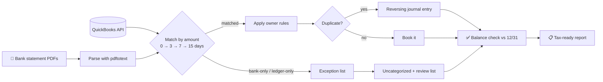
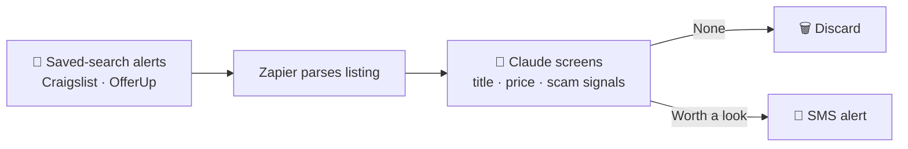

**Outhai (Thai) Xayavongsa** · Applied AI · Agentic Automation · Compliance & Document Intelligence

> I build AI agents and automations that do **real operational work** for small businesses: reconciling books, screening deals, producing marketing content, and shipping the web tools customers use. Everything here was built for businesses I run, then sanitized for public view.

---

## 🧭 At a glance

<table>
<tr>
<td width="50%" valign="top">

### 🤖 Agents & workflows
**4** production agents and pipelines
Scheduled, guardrailed, tool-using

</td>
<td width="50%" valign="top">

### 🌐 Live demos
**5** pages running on GitHub Pages
Click any **▶ Live** badge below to try one

</td>
</tr>
</table>

---

## 🤖 Agents & scheduled workflows

<table>
<tr>
<td width="50%" valign="top">

### 🧾 [Bookkeeping Reconciliation Agent](agents/bookkeeping-reconciliation-agent/)
Cron-scheduled agent that reconciles QuickBooks to bank-statement PDFs, reverses duplicates with journal entries, applies owner rules, and returns a tax-ready review packet.

  

</td>
<td width="50%" valign="top">

### 🚗 [Vehicle Deal Screener](agents/vehicle-deal-screener/)
Marketplace alerts → LLM classifier → SMS. Texts only listings that clear a resale-profit and clean-title bar.

  

</td>
</tr>
<tr>
<td width="50%" valign="top">

### 🎬 [Short-Form Video Pipeline](agents/short-form-video-pipeline/)
Topic → script → timed scenes → a real CapCut project file, written directly by the agent through an MCP server.

  

</td>
<td width="50%" valign="top">

### 📣 [AI Video Ad Generator](agents/ai-video-ad-generator/)
Reusable prompt system for realistic 15-second vertical commercials for local businesses.

 

</td>
</tr>
</table>

<b>🔍 How the reconciliation agent works</b> (click to expand)

**Guardrails:** the agent can't delete, send, or file anything. Every correction is a reversible journal entry, and anything unexplained goes to a human review list.

<b>🔍 How the deal screener works</b> (click to expand)

---

## 🛠️ Apps & tools

| | Project | What it does | Try it |
|:-:|---|---|:-:|
| 📵 | [**Junk Text Triage**](apps/junk-text-triage/) | Private, in-browser SMS-backup analyzer. Ranks junk senders and sorts them into scam, marketing, and OTP. Nothing is uploaded |  |
| ⚡ | [**Dev Cheatsheets**](apps/dev-cheatsheets/) | Side-by-side syntax for Python, JavaScript, SQL, Java, C++, and Bash |  |

## 🌐 Websites

| | Project | Highlights | Try it |
|:-:|---|---|:-:|
| 🖋️ | [**Mobile Notary Services & Pricing**](websites/) | Animated ticker, tiered service roadmap, intro-rate pricing, 5-step booking flow |  |
| ✅ | [**Notary Onboarding Guide**](websites/) | Interactive New vs. Renewing checklist with a resource hub |  |

## 📐 Product design

| | Project | Summary | Read it |
|:-:|---|---|:-:|
| 🧾 | [**AI Receipt & Mileage App: PRD**](product-specs/expense-mileage-app/) | Pricing tiers, 7 industry templates, a dimension-based data model, AI OCR and categorization, phased build plan |  |

## 🐍 More code

Python agents that run my notary admin every morning (rotation tracking, ad-queue checks, quote estimates) live in **[ai-agents](https://github.com/oxayavongsa/ai-agents)**.

---

## 💡 What I bring

<b>Skills</b>

- 🛡️ **Agent design with guardrails:** scheduled, unattended agents with explicit forbidden actions, reversible corrections, and human-review queues
- 🔌 **Tool integration:** MCP servers, REST connectors (QuickBooks, Square, Stripe, Calendly), no-code orchestration (Zapier)
- 📄 **Document intelligence:** PDF and statement parsing, OCR pipelines, classification with confidence gating
- ⚖️ **Compliance depth:** certified payroll, Davis-Bacon and prevailing wage, fringe benefits, union agreements
- 🚀 **Full-stack delivery:** from PRD and data model to a shipped, responsive front end

### 🧰 Stack

     

---

**Open to remote AI/ML, automation, and payroll-tech roles.**

